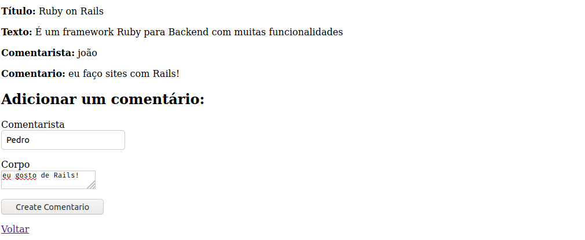

# Adicionando Comentários aos Artigos

Agora vamos adicionar uma nova feature ao nosso site, a posssibilidade de adicionarmos comentários aos artigos.

Primeiro vamos criar o *model* de comentários, o comentarista será quem comentou, corpo será o texto do comentário e o artigo será uma chave estrangeira que irá referenciar qual é o artigo que este comentário pertence, dessa maneira:

``rails generate model Comentario comentarista:string corpo:text artigo:references``

Agora vamos fazer a migration para criar efetivamente o *model*.

``rails db:migrate``

Agora apenas veja o arquivo ``apps/models/comentario.rb`` e você verá que este *model* comentário pertence ao *model* artigos, pois nós definimos na criação no *model*, usando: ``artigo:references``:

```ruby
class Comentario < ApplicationRecord
  belongs_to :artigo
end
```

Agora vamos associar os dois modelos, abra ``apps/models/artigos.rb`` e escreva:

```ruby
class Artigo < ApplicationRecord
  has_many :comentarios
  validates :titulo, presence: true,
                    length: { minimum: 5 }
end
```

Pronto, agora definimos que todo artigo tem vários comentários.

Agora vamos gerar uma rota, que será utilizada pelo Rails para saber onde os comentários estão:

```ruby
Rails.application.routes.draw do
  get 'welcome/index'

  resources :artigos do
    resources :comentarios
  end

  root 'welcome#index'
end
```

Agora vamos criar o *controller* dos comentários, assim poderemos manipular eles:

``
rails generate controller Comentarios
``

Agora vamos editar a view show em ``app/views/artigos/show.html.erb`` para o usuário poder ver os comentários:

```ruby
<p>
  <strong>Título:</strong>
  <%= @artigo.titulo %>
</p>
 
<p>
  <strong>Texto:</strong>
  <%= @artigo.texto %>
</p>

<h2>Adicionar um comentário:</h2>
<%= form_with(model: [ @artigo, @artigo.comentarios.build ], local: true) do |form| %>
  <p>
    <%= form.label :comentarista %><br>
    <%= form.text_field :comentarista %>
  </p>
  <p>
    <%= form.label :corpo %><br>
    <%= form.text_area :corpo %>
  </p>
  <p>
    <%= form.submit %>
  </p>
<% end %>

<%= link_to "Voltar", artigos_path %>
```

Agora vamos editar o *controller* dos comentários em ``app/controllers/comentarios_controller.rb``, possibilitando a criação de um novo comentário em um artigo:

```ruby
class ComentariosController < ApplicationController
  def create
    @artigo = Artigo.find(params[:artigo_id])
    @comment = @artigo.comentarios.create(comentario_params)
    redirect_to artigo_path(@artigo)
  end
 
  private
    def comentario_params
      params.require(:comentario).permit(:comentarista, :corpo)
    end
end
```

Agora vamos alterar a view show novamente para mostrarmos os comentários acima do formulário de criação de um:

```ruby
<p>
  <strong>Título:</strong>
  <%= @artigo.titulo %>
</p>
 
<p>
  <strong>Texto:</strong>
  <%= @artigo.texto %>
</p>

<% @artigo.comentarios.each do |comentario| %>
  <p>
    <strong>Comentarista:</strong>
    <%= comentario.comentarista %>
  </p>
 
  <p>
    <strong>Comentario:</strong>
    <%= comentario.corpo %>
  </p>
<% end %>

<h2>Adicionar um comentário:</h2>
<%= form_with(model: [ @artigo, @artigo.comentarios.build ], local: true) do |form| %>
  <p>
    <%= form.label :comentarista %><br>
    <%= form.text_field :comentarista %>
  </p>
  <p>
    <%= form.label :corpo %><br>
    <%= form.text_area :corpo %>
  </p>
  <p>
    <%= form.submit %>
  </p>
<% end %>

<%= link_to "Voltar", artigos_path %>
```

Pronto! agora podemos ver e adicionar novos comentários:


