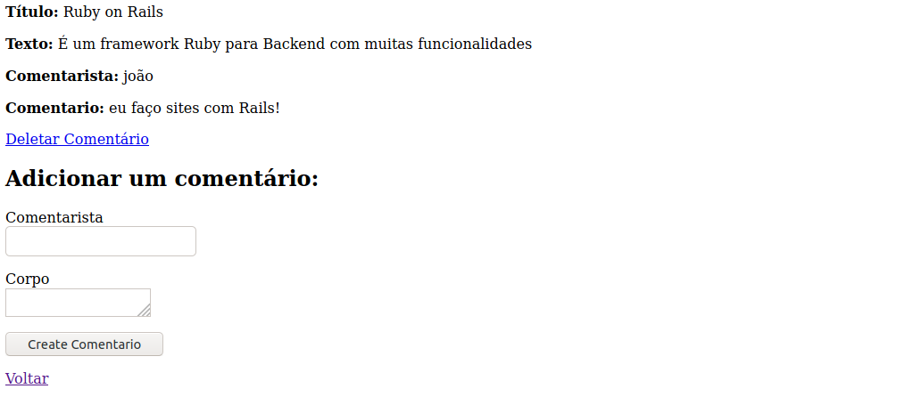

# Deletando Comentários

Agora vamos colocar a última feature do nosso site, a opção de deletar comentários.

Edite o arquivo ``app/views/comentarios/_comentario.html.erb`` e escreva o link de delete do comentário:

```ruby
  <p>
    <strong>Comentarista:</strong>
    <%= comentario.comentarista %>
  </p>
 
  <p>
    <strong>Comentario:</strong>
    <%= comentario.corpo %>
  </p>

  <p>
    <%= link_to 'Deletar Comentário', [comentario.artigo, comentario],
				      method: :delete,
				      data: { confirm: 'Você tem Certeza?' } %>
  </p>
```

Agora vamos no *controller* de comentários e escreva a função de destroy:

```ruby
class ComentariosController < ApplicationController
  def create
    @artigo = Artigo.find(params[:artigo_id])
    @comment = @artigo.comentarios.create(comentario_params)
    redirect_to artigo_path(@artigo)
  end

  def destroy
    @artigo = Artigo.find(params[:artigo_id])
    @comentario = @artigo.comentarios.find(params[:id])
    @comentario.destroy
    redirect_to artigo_path(@artigo)
  end
 
  private
    def comentario_params
      params.require(:comentario).permit(:comentarista, :corpo)
    end
end
```

Agora vamos ao *model* de artigos ``app/models/artigo.rb`` e vamos definir que se um artigo for deletado, todos os dependentes, que no caso são os comentários, também serão deletados, da seguinte maneira:

```ruby
class Artigo < ApplicationRecord
  has_many :comentarios, dependent: :destroy
  validates :titulo, presence: true,
                    length: { minimum: 5 }
end

```

``dependent: :destroy`` avisa ao Rails que se caso algum item deste model for deletado, todos os items que tem como referencia este item do model que está sendo deletado, serão deletados, que no caso, se um artigo for deletado, todos os comentários dele também serão.

Pronto!, agora temos o botão para deletar um comentário, e se caso deletarmos um artigo, todos os seus comentários também serão deletados!

