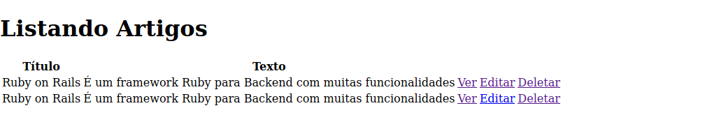
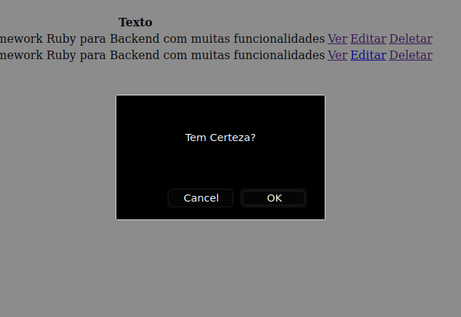

# Deletando Dados

Agora vamos colocar uma nova funcionalidade, a possibilidade de deletar artigos, ao lado do botão de ver e editar, vamos criar essa função no *controller* de artigos, em ``app/controllers/artigos_controller.rb``:

```ruby
class ArtigosController < ApplicationController
  def index
    @artigos = Artigo.all
  end

  def show
    @artigo = Artigo.find(params[:id])
  end

  def new
    @artigo = Artigo.new
  end

  def edit
    @artigo = Artigo.find(params[:id])
  end

  def update
    @artigo = Artigo.find(params[:id])
 
  if @artigo.update(artigo_params)
    redirect_to @artigo
  else
    render 'edit'
  end
  end
 
  def create
    @artigo = Artigo.new(artigo_params)
 
    if @artigo.save
        redirect_to @artigo
    else
        render 'new'
    end
  end

  def destroy
    @artigo = Artigo.find(params[:id])
    @artigo.destroy

    redirect_to artigos_path
  end

  private
    def artigo_params
        params.require(:artigo).permit(:titulo, :texto)
    end
end
```

O arquivo está o mesmo, mas adicionamos a função destroy, que irá buscar o artigo com a ID específica, deletar ele e voltar para a lista que mostra todos os artigos.

Agora vamos voltar ao index, vamos adicionar um link (botão) para deletar algum artigo, em ``app/views/artigos/index.html.erb``:

```ruby
<h1>Listando Artigos</h1>
 
<table>
  <tr>
    <th>Título</th>
    <th>Texto</th>
    <th></th>
  </tr>
 
  <% @artigos.each do |artigo| %>
    <tr>
      <td><%= artigo.titulo %></td>
      <td><%= artigo.texto %></td>
      <td><%= link_to 'Ver', artigo_path(artigo) %></td>
      <td><%= link_to 'Editar', edit_artigo_path(artigo) %></td>
      <td><%= link_to 'Deletar', artigo_path(artigo),
                                method: :delete,
                                data: { confirm: 'Tem Certeza?' } %></td>
    </tr>
  <% end %>
</table>
```

Como podemos ver, o arquivo continua igual, mas temos um link, que leva ao artigo em questão, usando o método delete, com uma confirmação na tela de "Tem Certeza?", veja:





Caso clique em "Ok" o artigo será deletado.

## Proximo =>

[Adicionando Comentários](../adicionando-comentarios/README.md)