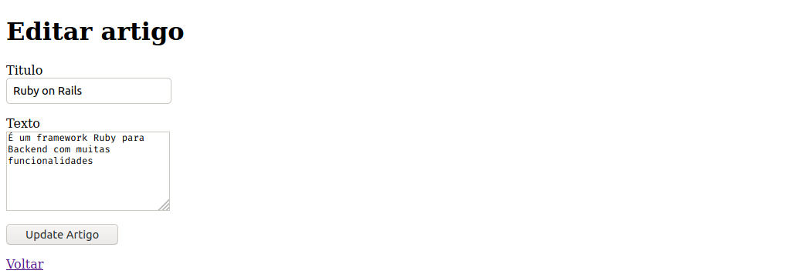
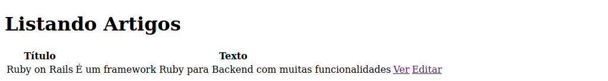

# Editando Dados

Agora vamos adicionar uma nova função no nosso blog de artigos, vamos dar a opção do usuário editar um artigo, primeiramente vamos criar no nosso *Controller* a função edit, que possibilitará que a rota artigos/edit funcione e que a view seja possível de ser visualizada.

```ruby
class ArtigosController < ApplicationController
  def index
    @artigos = Artigo.all
  end

  def show
    @artigo = Artigo.find(params[:id])
  end

  def new
    @artigo = Artigo.new
  end

  def edit
    @artigo = Artigo.find(params[:id])
  end

  def update
    @artigo = Artigo.find(params[:id])
 
  if @artigo.update(artigo_params)
    redirect_to @artigo
  else
    render 'edit'
  end
  end
 
  def create
    @artigo = Artigo.new(artigo_params)
 
    if @artigo.save
        redirect_to @artigo
    else
        render 'new'
    end
  end

  private
    def artigo_params
        params.require(:artigo).permit(:titulo, :texto)
    end
end
```

O *controller* continua igual, mas tem uma função chamada edit, e uma outra chamada update, a edit criará a rota artigos/edit, e a update irá buscar o artigo com a ID específica, e esse artigo será mandado para a view, é por isso que na view podemos usar os dados específicos de um ou mais artigos, tudo depende do que está sendo feito dentro do *controller*.

Crie agora o arquivo ``app/views/artigos/edit.html.erb`` com um conteúdo muito parecido com o da view new, mas com as opções necessárias para a edição, escreva com o conteúdo abaixo:

```ruby
<h1>Editar artigo</h1>
 
<%= form_with(model: @artigo, local: true) do |form| %>
 
  <% if @artigo.errors.any? %>
    <div id="error_explanation">
      <h2>
        <%= pluralize(@artigo.errors.count, "error") %> Probido de ser salvo este artigo pois:
      </h2>
      <ul>
        <% @artigo.errors.full_messages.each do |msg| %>
          <li><%= msg %></li>
        <% end %>
      </ul>
    </div>
  <% end %>
 
  <p>
    <%= form.label :titulo %><br>
    <%= form.text_field :titulo %>
  </p>
 
  <p>
    <%= form.label :texto %><br>
    <%= form.text_area :texto %>
  </p>
 
  <p>
    <%= form.submit %>
  </p>
 
<% end %>
 
<%= link_to 'Voltar', artigos_path %>
```

Como podemos ver, o model está setado para @artigo, que é a variável que guarda os dados do artigo em questão.

Agora vamos mudar o index, e adicionar um link que leva á edição dos artigos, assim cada artigo terá dois botões, um para ver (show) e outro para editar (edit), veja abaixo:

```ruby
<h1>Listando Artigos</h1>
 
<table>
  <tr>
    <th>Título</th>
    <th>Texto</th>
    <th></th>
  </tr>
 
  <% @artigos.each do |artigo| %>
    <tr>
      <td><%= artigo.titulo %></td>
      <td><%= artigo.texto %></td>
      <td><%= link_to 'Ver', artigo_path(artigo) %></td>
      <td><%= link_to 'Editar', edit_artigo_path(artigo) %></td>
    </tr>
  <% end %>
</table>
```

Como podemos ver, o link para editar o artigo é ``edit_artigo_path(artigo)``

E pronto!, agora podemos editar o artigo:



Salvar e ver o artigo editado:




## Proximo =>

[Removendo Duplicação no código](../duplicacao/README.md)