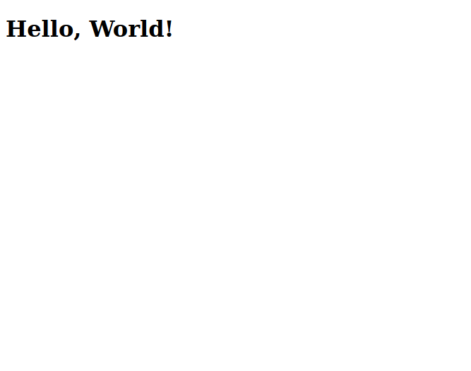

# Hello World em Rails

Para criarmos uma página em nosso projeto, com um texto "Hello World!" na tela, precisaremos criar uma *route*, que será o caminho para chegar na página com o texto, e uma *view*, que é o conteúdo da página, no Rails, usamos HTML junto com o Rails, podendo colocar partes do HTML que será completada pelo Rails, você entenderá isso mais adiante, agora, você apenas usará o HTML.

Primeiro precisamos criar um *Controller*, que receberá requisições específicas, enquanto a rota controlará qual controller vai receber a requisição, em Rails, podemos criar o controller ``Welcome`` com o seguinte comando:

``rails generate controller Welcome index``

A *view* irá mostrar o conteúdo de uma maneira que seja legível para humanos, como o HTML que irá se transformar em uma página web, enquanto o *controller* captura a informação, a *view* apenas mostrará ela ao usuário.

Agora abra o arquivo ``app/views/welcome/index.html.erb`` delete todo o código que estava escrito e coloque o conteúdo:

````html
<h1>Hello, World!</h1>
````

Lembrando, não copie e cole o código, escreva ele, isso é importante para seu aprendizado.

A página ainda não pode ser aberta, pois ainda não definimos ela nas rotas, para adicionar essa página nas rotas, abra ``config/routes.rb`` e escreva:

````ruby
Rails.application.routes.draw do
  get 'welcome/index'
 
  root 'welcome#index'
end
````

no código acima, estamos usando o ``get`` para pegar o ``welcome`` que é o nosso controller, e o ``root`` está definindo que o index do welcome (a view que acabamos de criar) será a página inicial da nossa aplicação.

Lembrando que o ``get`` você não precisou escrever, pois ele foi colocado aqui pelo própio ruby, quando executamos ``rails generate controller Welcome index``

Pronto, agora temos nossa página de Hello World pronta!

