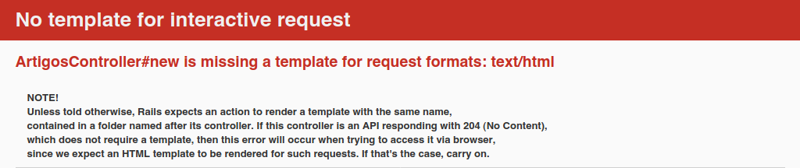
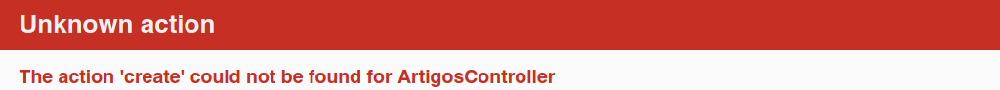
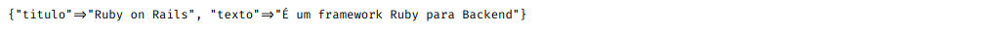
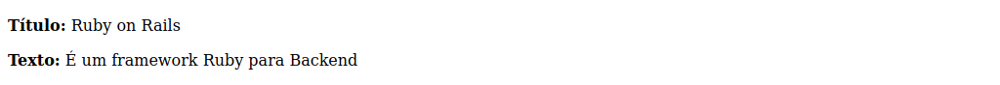

# Inserindo Dados

Agora vamos fazer o "C" do CRUD, que é o create (criar), o que queremos fazer é uma página que peça ao usuário o título do artigo e o texto do artigo, é um exemplo bem simples e básico para compreendermos como funciona o Rails.

Agora crie o *controller* de Artigos, da mesma forma que o Welcome, dessa maneira:

``rails generate controller Artigos``

Com isso, geramos o *Controller* Artigos, agora podemos adicionar, visualizar, editar e remover artigos.

Agora abra o arquivo ``app/controllers/artigos_controllers.rb``, você vai ver isso aqui:

```ruby
class ArtigosController < ApplicationController
end
```

Como podemos ver, o *Controller* está vazio, ele não faz nada, será aqui que colocaremos todas as funções do CRUD.

Abra ``app/controllers/artigos_controllers.rb`` novamente e escreva:

```ruby
class ArtigosController < ApplicationController
    def new
    end
end
```

Agora tente criar um novo Artigo indo em [localhost:3000/artigos/new](http://localhost:3000/artigos/new)



Como você pode ver acima, ocorreu um erro, pois como no Welcome, precisamos criar uma *view*, pois o *Controller* vai fazer a requisição, a *view* vai receber esses dados e mostrar ele ao usuário.

Abra ``apps/views/artigos/new.html.erb``, que é o arquivo da view do nosso *Controller* Artigos e escreva

```html
<h1>Novo Artigo</h1>
```

Pronto!, agora quando você entra em ``artigos/new`` aparece uma página simples, agora precisamos inserir o formulário e a função de criar dentro do *Controller* dos artigos.

Agora entre no ``apps/views/artigos/new.html.erb`` e ESCREVA:

```ruby
<%= form_with scope: :artigo, url: artigos_path, local: true do |form| %>
  <p>
    <%= form.label :titulo %><br>
    <%= form.text_field :titulo %>
  </p>
 
  <p>
    <%= form.label :texto %><br>
    <%= form.text_area :texto %>
  </p>
 
  <p>
    <%= form.submit %>
  </p>
<% end %>
```

Explicação do código acima:

- A primeira linha inicia o formulário, o ``form_with scope: :artigo`` determina que o form será para o nosso *Controller* Artigos.
- ``url: artigos_path```diz que quando o form for enviado, o usuário será redirecionado para a página que lista os artigos, que iremos fazer mais tarde. 
- Cada ``<p>`` contém o input que será enviado ao *Controller*, com o ``:titulo`` ou ``:texto``.
- o ``form.submit`` cria o botão que será usado para enviar o formulário.

Agora, quando você tentar enviar o formulário, irá aparecer isto na tela:



Como nós não criamos a função para salvar os dados que criamos no formulário, o Rails dá este erro, vamos então criar esta função, mas vamos apenas mandar os dados serem mostrados na tela.

Abra o arquivo ``apps/controllers/artigos_controller.rb`` e escreva:

```ruby
class ArtigosController < ApplicationController
  def new
  end
 
  def create
    render plain: params[:artigo]
  end
end
```

Agora quando inserimos um título e texto no formulário seremos redirecionados á uma página vazia, apenas com os valores que inserimos:



No caso, o Output dará o titulo sendo "Ruby on Rails" e o texto sendo "é um framework Ruby para Backend"

## Salvando no Banco de Dados

Para salvarmos no Banco de Dados precisaremos criar um *Model*, um *Model* representa uma tabela no banco de dados, que no caso, iremos usar o SQLite, para criarmos um novo *Model* chamado Artigo é bem simples:

``rails generate model Artigo titulo:string texto:text``

Estamos criando uma tabela chamada Artigo, com as colunas título e texto, o título é uma string enquanto texto é um text, podendo guardar uma string muito grande.

Agora você precisa rodar essa migration, para ela se tornar efetiva, em Rails é assim:

``rails db:migrate``

Pronto, o *model* foi criado.

Agora vamos voltar ao ``apps/controllers/artigos_controller.rb`` e vamos alterar a função de create.

```ruby
class ArtigosController < ApplicationController
  def new
  end
 
  def create
    @artigo = Artigo.new(artigo_params)
 
    @artigo.save
    redirect_to @artigo
  end

  private
    def artigo_params
        params.require(:artigo).permit(:titulo, :texto)
    end
end
```

No códgio acima fazemos:

- A função create começa criando um novo artigo, passando como parametro uma função chamada ``artigo_params``.
- A função artigo_params é uma camada de segurança, pois ela só vai permitir que o título e o texto do artigo sejam enviados.
- O ``@artigo.save`` salva o artigo no banco de dados, e logo depois, redireciona o usuário a uma página que mostra o artigo que ele enviou.

Tente enviar um novo artigo, ele será escrito no banco de dados, mas aparecerá este erro na tela:


Este erro ocorre pois não criamos uma função show para mostrar o artigo que foi criado, e é isso que iremos fazer agora.

Abra ``apps/controllers/artigos_controller.rb`` e escreva a função show

```ruby
class ArtigosController < ApplicationController
  def show
    @artigo = Artigo.find(params[:id])
  end

  def new
  end
 
  def create
    @artigo = Artigo.new(artigo_params)
 
    @artigo.save
    redirect_to @artigo
  end

  private
    def artigo_params
        params.require(:artigo).permit(:titulo, :texto)
    end
end
```

Podemos ver que o código está igual, a diferença é que temos uma função chamada show, que procura um artigo passando como parâmetro o id dele, que é numérico.

Agora vamos criar um arquivo em ``app/views/articles/show.html.erb``, que é a view do show, assim, poderemos mostrar o artigo que foi feito pelo usuário para o usuário, escreva este código nele:

```ruby
<p>
  <strong>Título:</strong>
  <%= @artigo.titulo %>
</p>
 
<p>
  <strong>Texto:</strong>
  <%= @artigo.texto %>
</p>
```

Como podemos ver nele, dentro do artigo há todos os dados referentes ao artigo, que no caso, é o seu título e o seu texto, que serão mostrados na tela.

E pronto!, lembra daquele artigo que enviamos pelo formulário e que não podiamos ver? agora conseguimos, apenas atualize a página e você verá o artigo:



E pronto! é dessa maneira que podemos ver o artigo que acabamos de criar.

## Proximo =>

[Listando Todos os Artigos](../listando-dados/README.md)