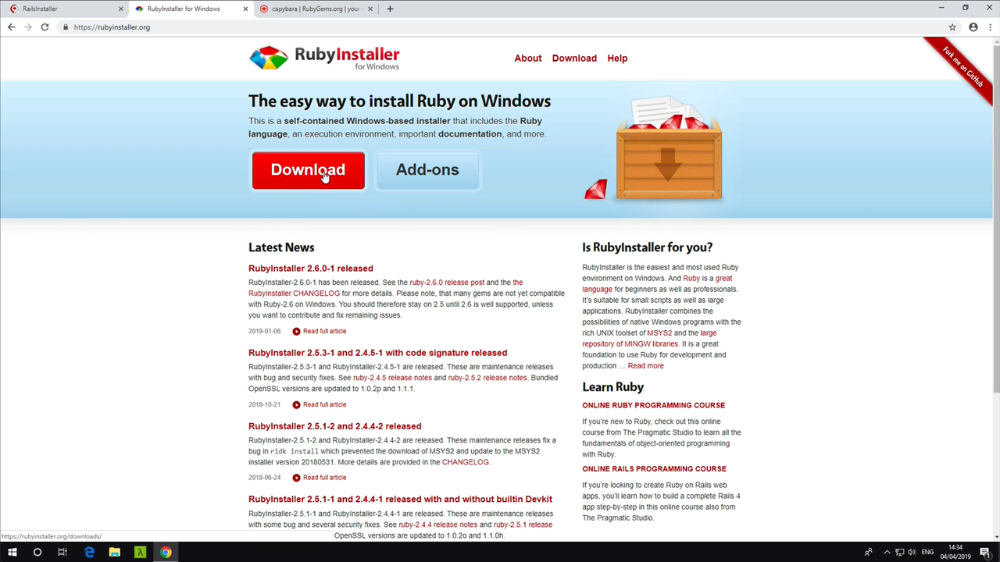
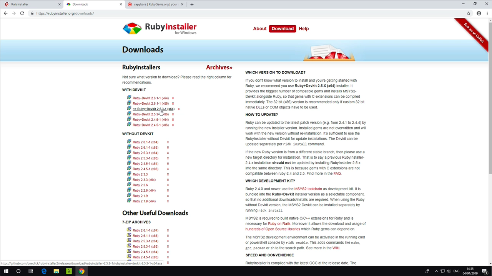
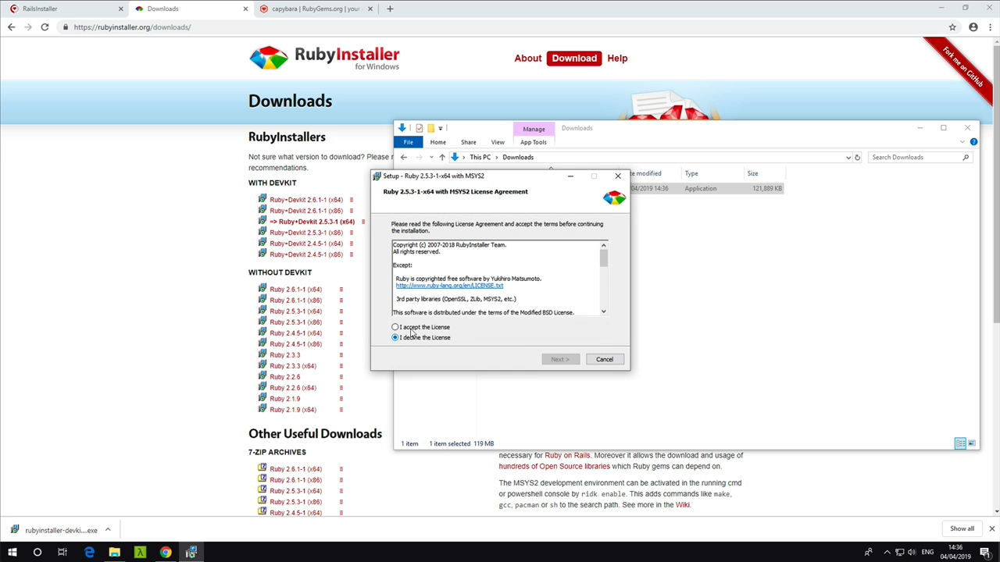
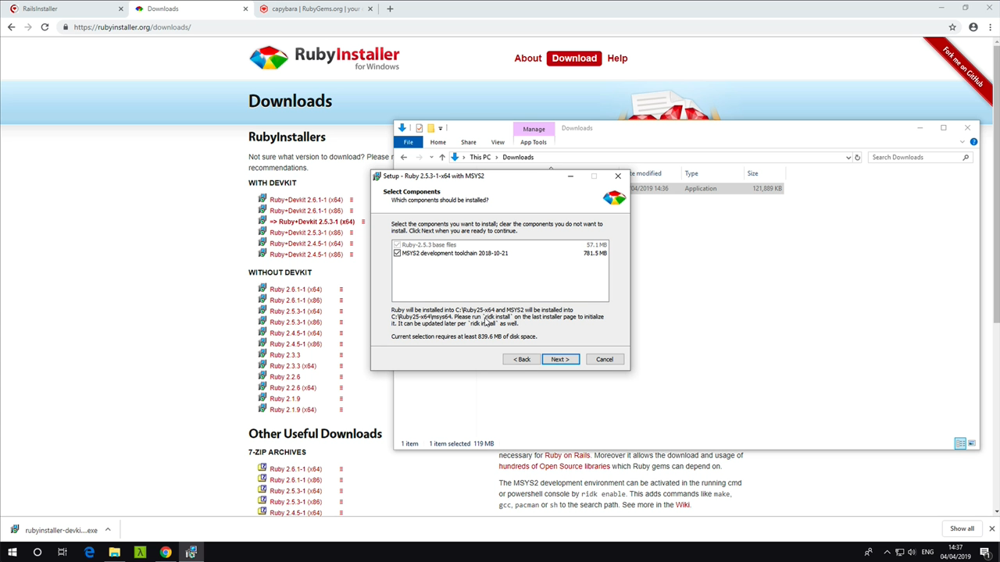
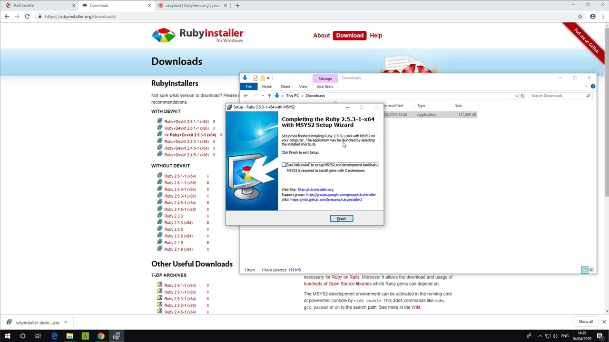
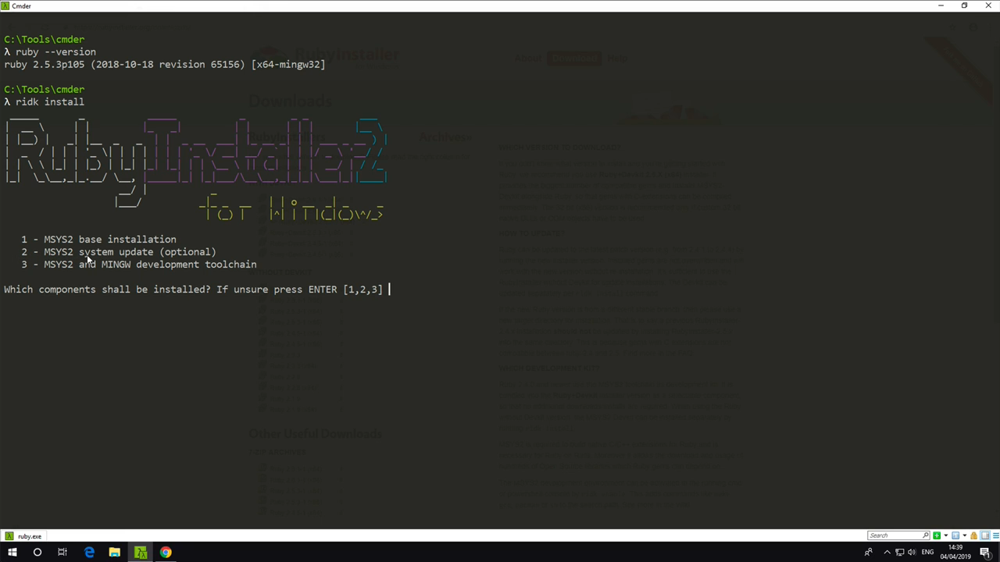
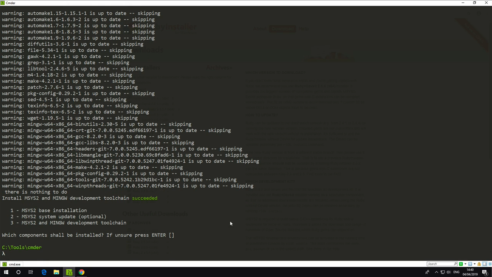
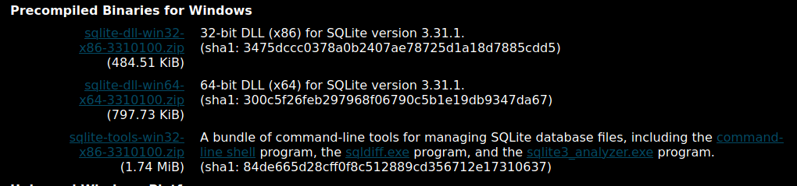
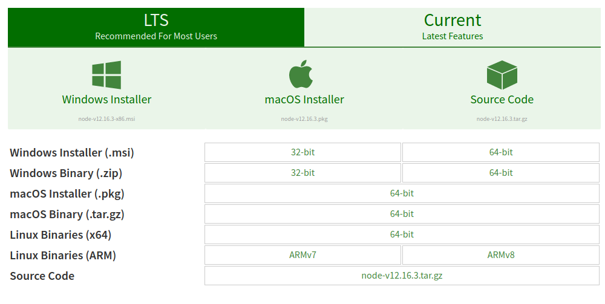

# Instalando Ruby on Rails no Windows

Caso ainda não tenha baixado, baixe o Ruby no seu sistema:

Acesse o site do [Ruby Installer](https://rubyinstaller.org/)

Selecione a versão recomendada, que está marcada com um => antes do nome e versão

Com o instalador baixado, clique duas vezes nele no Windows Explorer e comece a instalar como se fosse qualquer programa, aceitando os termos de uso por exemplo

Garanta que os dois pacotes abaixo estão selecionados para serem instalados

Desmarque o checkbox "Run ridk install" to setup MSYS2 and development toolchain

Abra o prompt de comando ou preferencialmente o Powershell, e digite "ridk install", quando o comando ser executado aperte "3" para selecionar a terceira opção

Quando o instalador perguntar "Which components shall be installed?" apenas digite ENTER e pronto, o Ruby está instalado na sua máquina!

## SQLite

Sqlite será o banco de dados que iremos usar para armazenar os dados, para baixar o SQLite, entre no [site de download dele](https://www.sqlite.org/download.html) e procure os binários para Windows, que estão listados abaixo:

Agora crie uma nova pasta, localizada em ``C:\sqlite``, isso signfica que você precisa acessar a pasta raiz do seu sistema (c:) e criar uma pasta chamada sqlite lá dentro, agora extraia o ZIP do sqlite dentro dessa pasta, agora navegue para dentro dessa pasta dessa forma:

``cd c:\sqlite``

e lá dentro, digite:

``sqlite3``

E pronto! o SQLite já está instalado, você pode digitar ``.quit`` para sair do prompt do SQLite.

## Nodejs

O nodejs é uma maneira de rodar o Javascript na sua máquina, ele será usado pelo Rails, para instala-lo, entre na [Página de Download do Nodejs](https://nodejs.org/en/download/) e escolha o Windows Installer apertando em cima dele.

Depois de baixado, clique duas vezes no instalador e siga dando "Next" no wizard de instalação, por padrão você não precisa mudar nada.

Depois disso, teste se o Node está instalado, para isso, faça:

``node -v``

Caso seja retornada a versão atual do Node, está funcionando corretamente.

## Yarn

Yarn é uma das opções de gerenciador de pacotes do Node, ele também será usado exclusivamente pelo Rails

Para baixar o yarn, [Clique neste link para baixar a última versão](https://yarnpkg.com/latest.msi)

Depois disso, execute o wizard de instalação, Aceite os termos de uso e clique em "Next" até terminar a instalação.

Para testar se o Yarn está instalado, faça:

`` yarn --version``

Caso ele retorne a versão atual do yarn, tudo está correto.

## Gems

Agora você precisa instalar o Ruby Gems, que é o gerenciador de pacotes do Ruby, você usará o Gems para instalar os pacotes (como bibliotecas) e o próprio Rails na sua máquina.

Para baixar o Ruby Gems, entre no [site de download do Ruby Gems](https://rubygems.org/pages/download) e clique em ZIP, baixar ele em sua máquina, extraia-o, entre na pasta extraida do Ruby Gems usando o ``cd`` dessa maneira:

``cd Downloads\rubygems-[VERSÃO DO RUBYGEMS]``

e instale o Gems executando o ``setup.rb``, dessa maneira:

``ruby setup.rb``

agora para instalar o Rails em sua máquina é simples, apenas use o Gems para isso:

``gem install rails``

Pronto, agora para testar se o Rails foi instalado com sucesso, use:

``rails -v``

Caso apareça a versão atual do Rails, tudo está funcionando corretamente, e tods os pacotes e programas necessários foram instalados :smile:

## Proximo =>

[Criar Projeto em Rails](../criar-projeto/README.md)