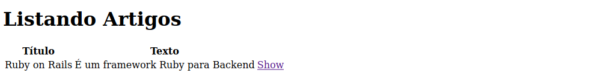

# Listando Dados

Já conseguimos criar o artigo e visualizar ele de maneira individual, agora precisamos listar todos os artigos, para isso, dentro do *Controller* do Artigo, iremos criar um método chamado index, que irá listar TODOS os artigos existentes.

Abra o arquivo ``apps/controler/artigos_controller.rb`` e escreva a função index:

```ruby
class ArtigosController < ApplicationController
  def index
    @artigos = Artigo.all
  end

  def show
    @artigo = Artigo.find(params[:id])
  end

  def new
  end
 
  def create
    @artigo = Artigo.new(artigo_params)
 
    @artigo.save
    redirect_to @artigo
  end

  private
    def artigo_params
        params.require(:artigo).permit(:titulo, :texto)
    end
end
```

Agora vamos criar a view index em ``apps/views/artigos/index.html.erb`` para mostrar os artigos:

```ruby
<h1>Listando Artigos</h1>
 
<table>
  <tr>
    <th>Título</th>
    <th>Texto</th>
    <th></th>
  </tr>
 
  <% @artigos.each do |artigo| %>
    <tr>
      <td><%= artigo.titulo %></td>
      <td><%= artigo.texto %></td>
      <td><%= link_to 'Ver', artigo_path(artigo) %></td>
    </tr>
  <% end %>
</table>
```

Pronto! Agora todos os artigos podem ser vistos, tente criar um novo artigo e ele aparecerá na lista.




## Adicionando Links

Agora entre na view da função new e adicione um link para voltar á página inicial abaixo do formulário:

```ruby
<%= form_with scope: :artigo, url: artigos_path, local: true do |form| %>
  <p>
    <%= form.label :titulo %><br>
    <%= form.text_field :titulo %>
  </p>
 
  <p>
    <%= form.label :texto %><br>
    <%= form.text_area :texto %>
  </p>
 
  <p>
    <%= form.submit %>
  </p>
<% end %>

<%= link_to "Voltar", artigos_path %>
```

Agora abra a view da função show e faça a mesma coisa:

```ruby
<p>
  <strong>Título:</strong>
  <%= @artigo.titulo %>
</p>
 
<p>
  <strong>Texto:</strong>
  <%= @artigo.texto %>
</p>

<%= link_to "Voltar", artigos_path %>
```

O que acabamos de fazer foi criar links que ajudarão o usuário a navegar entre as páginas.

## Proximo =>

[Validação de dados](../validacao-dados/README.md)