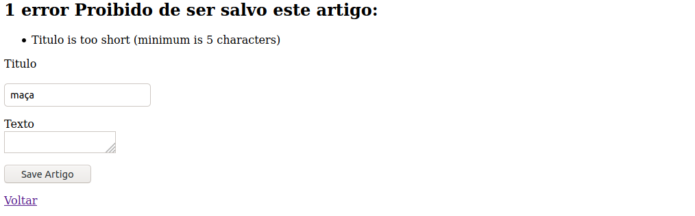

# Validando Dados

Agora vamos colocar uma camada de segurança, vamos validar o título e obrigar que ele tenha no mínimo 5 caracteres, podemos fazer isso facilmente em Rails, edite o *model* do artigo em ``apps/models/artigo.rb`` e escreva:

```ruby
class Artigo < ApplicationRecord
  validates :titulo, presence: true,
                    length: { minimum: 5 }
end
```

No caso, a validação está no título, onde determinados que ele deve aparecer, e que seu tamanho mínimo é 5.

Agora, quando executarmos ``@artigo.save`` e o título não for válido, retornará falso, então podemos mudar no nosso *Controller*, e mandar o usuário novamente ao formulário caso o título não seja válido dessa maneira:

```ruby
class ArtigosController < ApplicationController
  def index
    @artigos = Artigo.all
  end

  def show
    @artigo = Artigo.find(params[:id])
  end

  def new
    @artigo = Artigo.new
  end
 
  def create
    @artigo = Artigo.new(artigo_params)
 
    if @artigo.save
        redirect_to @artigo
    else
        render 'new'
    end
  end

  private
    def artigo_params
        params.require(:artigo).permit(:titulo, :texto)
    end
end
```

O código acima está normal, execeto que na função new, é criado o Artigo de maneira padrão, pois se não fizessemos isso, daria erro toda vez que entrassemos no artigo/new, e também, se ``@artigo.save`` ser falso, o usuário será movido ao new, que é a rota de criação do formulário.

Agora vamos abrir ``apps/views/artigos/new.html.erb`` e vamos colocar uma verificação de erros, caso existam erros, eles serão mostrados, que no caso, seria o título ser pequeno demais.

```ruby
<%= form_with scope: :artigo, url: artigos_path, local: true do |form| %>
 
  <% if @artigo.errors.any? %>
    <div id="error_explanation">
      <h2>
        <%= pluralize(@artigo.errors.count, "error") %> Proibido de ser salvo este artigo:
      </h2>
      <ul>
        <% @artigo.errors.full_messages.each do |msg| %>
          <li><%= msg %></li>
        <% end %>
      </ul>
    </div>
  <% end %>
 
  <p>
    <%= form.label :titulo %><br>
    <%= form.text_field :titulo %>
  </p>
 
  <p>
    <%= form.label :texto %><br>
    <%= form.text_area :texto %>
  </p>
 
  <p>
    <%= form.submit %>
  </p>
 
<% end %>
 
<%= link_to 'Voltar', artigos_path %>
```

Pronto!, tente criar um artigo com o título com menos de 5 caracteres agora:

